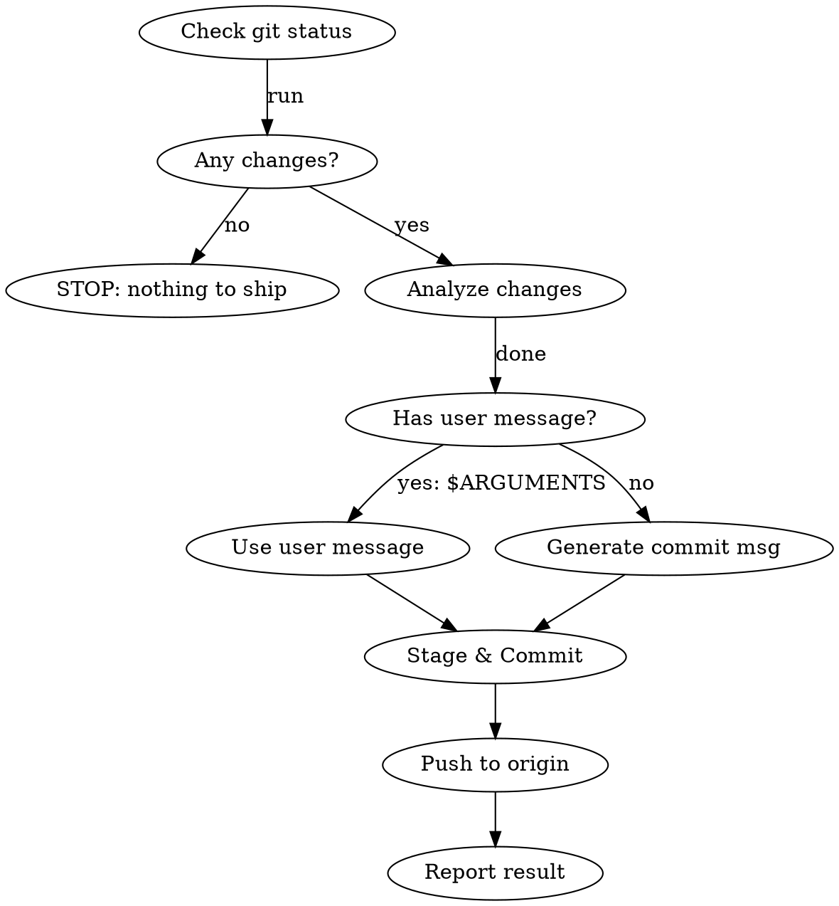

# Ship -- Commit & Push to GitHub

## Overview

Stage all changes, generate a commit message following this repo's conventions, commit, and push to origin. One command, zero friction.

## Workflow

## Steps

1. **Check status**: Run `git status` and `git diff --stat` to see what changed.
2. **Abort if clean**: If no staged, unstaged, or untracked changes exist, tell the user "Nothing to ship" and stop.
3. **Read recent commits**: Run `git log --oneline -5` to match the repo's commit message style.
4. **Generate commit message** (unless `$ARGUMENTS` provides one):
   - Follow the repo's existing convention (look at recent commits).
   - Use conventional commits format: `type: short description`
   - Types: `feat`, `fix`, `refactor`, `docs`, `chore`, `test`, `style`, `perf`
   - Keep the subject line under 72 characters.
   - Add a blank line and body only if the change is non-trivial.
5. **Stage files**: Use `git add` with specific file paths. Do NOT use `git add -A` or `git add .`. Exclude `.env`, credentials, secrets, and large binaries.
6. **Commit**: Create the commit. Append the sign-off line from git config user.name.
7. **Push**: Run `git push` to origin. If no upstream is set, use `git push -u origin <current-branch>`.
8. **Report**: Show the commit hash, message, and push result to the user.

## Commit Message from Arguments

If `$ARGUMENTS` is provided, use it as the commit message directly. Still follow conventional commit format -- if the user's message doesn't include a type prefix, infer the best one from the changes and prepend it.

**Example:** User says `/ship fix login redirect` -> commit message becomes `fix: fix login redirect`

## Safety Rules

- **NEVER** commit files matching: `.env*`, `credentials*`, `*.key`, `*.pem`, `secrets*`, `token*`
- **NEVER** force push (`--force` or `--force-with-lease`) unless the user explicitly says to
- **NEVER** skip hooks (`--no-verify`)
- If pre-commit hooks fail, fix the issue and retry -- do NOT bypass
- If push fails due to remote changes, tell the user to pull first -- do NOT force push

## Error Handling

| Error | Action |
|-------|--------|
| Nothing to commit | Say "Nothing to ship" and stop |
| Pre-commit hook fails | Show the error, fix if possible, retry |
| Push rejected (behind remote) | Tell user: "Remote has new changes. Run `git pull` first." |
| No remote configured | Tell user: "No remote configured. Add one with `git remote add origin <url>`" |
| Auth failure | Tell user to check their GitHub credentials/SSH keys |
